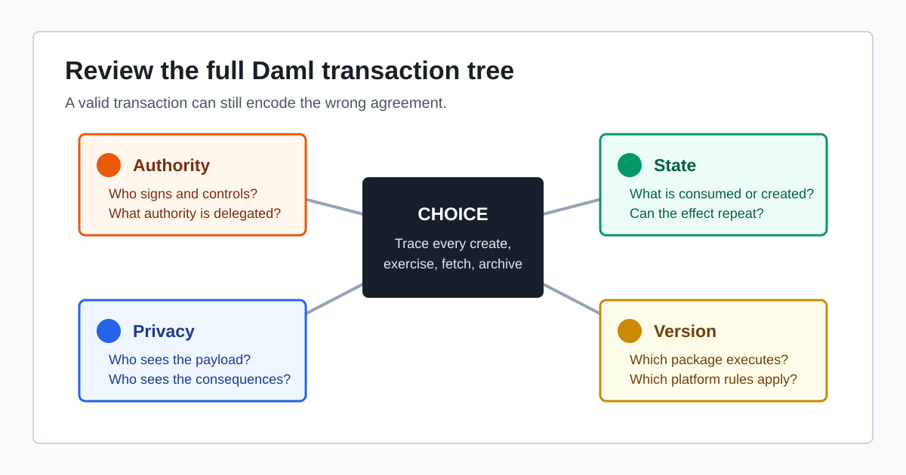

# Daml Smart Contract Vulnerabilities: 8 Authorization and Privacy Risks

Daml prevents many low-level smart contract bugs, but it does not decide whether a business workflow gives the right parties the right authority. This guide explains eight Daml security risks, how to recognize them during review, and how to test the intended fix.

## TL;DR

- Most serious Daml vulnerabilities are authorization, privacy, and business-logic errors rather than EVM-style memory or callback bugs.
- Review every template by asking who can create it, archive it, observe it, and exercise each choice.
- A signatory lends authority to the consequences of choices on its contract. A narrowly named choice can therefore grant broader power than its controller appears to have.
- `nonconsuming` choices are repeatable. Do not use them for redemption, payment, issuance, or another one-time effect.
- `ensure`, `assert`, and negative Daml Script tests are required for economic invariants; the type checker cannot infer business rules.
- Contract-key behavior is version-dependent. Do not treat a negative lookup as proof that no matching contract exists elsewhere.

This article is for Daml developers and reviewers searching for a Daml smart contract security checklist or examples of Daml authorization vulnerabilities. Readers who first need the language mechanics should start with [Writing Correct Daml Contracts on Canton](https://scauditstudio.com/blog/Writing-Correct-Daml-Contracts-on-Canton). Teams moving from Solidity should also read the [EVM-to-Canton development guide](https://scauditstudio.com/blog/EVMtoCantonGuide).

## Table of Contents

1. [Why Daml Has a Different Threat Model](#why-daml-has-a-different-threat-model)
2. [1. Weak Signatories and Unilateral Archival](#1-weak-signatories-and-unilateral-archival)
3. [2. Flexible Controller Escalation](#2-flexible-controller-escalation)
4. [3. Excess Authority in Choice Consequences](#3-excess-authority-in-choice-consequences)
5. [4. Repeatable Effects in Nonconsuming Choices](#4-repeatable-effects-in-nonconsuming-choices)
6. [5. Missing Economic and State Invariants](#5-missing-economic-and-state-invariants)
7. [6. Privacy Leaks Through Observers and Transaction Consequences](#6-privacy-leaks-through-observers-and-transaction-consequences)
8. [7. Unsafe Contract-Key Assumptions](#7-unsafe-contract-key-assumptions)
9. [8. Business-Logic Regressions During Upgrades](#8-business-logic-regressions-during-upgrades)
10. [Daml and Solidity: Different Review Priorities](#daml-and-solidity-different-review-priorities)
11. [Daml Security Review Checklist](#daml-security-review-checklist)
12. [FAQ](#faq)

## Why Daml Has a Different Threat Model

[Daml](https://www.digitalasset.com/daml-finance) is developed by [Digital Asset](https://www.digitalasset.com/about) for multi-party applications. A Daml ledger stores immutable contract instances. State changes occur by creating contracts and exercising choices, often consuming an old contract and creating a replacement.

The language and ledger model enforce authorization rules. Creation requires the authority of a contract's signatories, exercising a choice requires its controllers, and the consequences of an exercise receive authority from both the choice actors and the signatories of the contract being exercised. The official [parties and authority tutorial](https://docs.digitalasset.com/build/3.5/tutorials/smart-contracts/parties.html) demonstrates these rules with the same IOU pattern used below.

That enforcement is important, but it only proves that a transaction follows the authorization model written in the templates. It cannot prove that the model matches the parties' real agreement. If an administrator is made a signatory, an operator is made a controller, or a counterparty is added as an observer, the runtime assumes those declarations are intentional.



The practical review unit is not an isolated function. It is the full transaction tree produced by a choice:

- Which parties authorize the root command?
- Which signatories add authority inside the choice body?
- Which contracts are created, fetched, exercised, or archived below it?
- Which parties learn the parent action and its consequences?
- Can the same effect occur twice or under an unexpected package version?

The following examples are deliberately small. In a real application, the dangerous action may be several nested exercises away from the choice that a user sees.

## 1. Weak Signatories and Unilateral Archival

### The risk

Signatories must authorize contract creation and are controllers of the implicit `Archive` choice. If an issuer is the only signatory on an IOU, the issuer can archive it without the owner's consent. Making the owner an observer gives the owner visibility, not veto power.

```daml
template SimpleIou
  with
    issuer : Party
    owner : Party
    amount : Decimal
  where
    signatory issuer
    observer owner
    ensure amount > 0.0
```

After the owner provides goods or another off-ledger consideration, the issuer can submit:

```daml
submit issuer do
  archiveCmd iouId
```

This is not a runtime bypass. The model explicitly permits it. The misconception is assuming that an observer's interest in a contract gives that party control over its lifetime.

### The fix

If both parties must approve destruction or replacement of the obligation, both need to be signatories:

```daml
template Iou
  with
    issuer : Party
    owner : Party
    amount : Decimal
  where
    signatory issuer, owner
    ensure amount > 0.0
```

Co-signing also means the owner must authorize creation. Use a propose-accept workflow when the issuer must first publish an offer that the owner can inspect and accept. Do not add co-signatories mechanically: every signatory contributes authority inside choices, which creates the next class of risk.

**Review question:** Which party would suffer if this contract disappeared, and does that party either sign the contract or explicitly trust every signatory?

## 2. Flexible Controller Escalation

### The risk

A flexible controller is calculated from choice arguments at exercise time. This is useful when the controller is not known at contract creation, but an unchecked party argument can let any party with visibility nominate itself.

```daml
template RoleRequest
  with
    admin : Party
    nominee : Party
    reviewers : [Party]
  where
    signatory admin
    observer nominee, reviewers

    choice ClaimRole : ContractId OperatorRole
      with
        claimant : Party
      controller claimant
      do
        create OperatorRole with
          admin
          operator = claimant
```

If a reviewer can see `RoleRequest`, that reviewer can pass itself as `claimant`. The participant still checks that the reviewer is authorized to act as its own party; the bug does **not** permit party impersonation. The problem is that the template accepts any visible party as the controller and then records that party as the operator.

### The fix

Use the party stored in the contract when it is known:

```daml
    choice ClaimRole : ContractId OperatorRole
      controller nominee
      do
        create OperatorRole with
          admin
          operator = nominee
```

If the workflow genuinely needs a flexible controller, bind it to contract state with `assertMsg` and test every unintended visible party with `submitMustFail`. The Daml [choice reference](https://docs.digitalasset.com/build/3.5/reference/daml/choices.html) also notes that controllers need contract visibility; visibility is a prerequisite for exercising a choice, not a substitute for an authorization rule.

**Review question:** Is any `controller` derived from a choice argument, and what prevents a visible but unintended party from supplying itself?

## 3. Excess Authority in Choice Consequences

### The risk

The consequences of a choice are authorized by its actors plus the signatories of the contract on which it is exercised. This enables multi-party workflows, but it can also turn a limited operator role into a broad delegation.

```daml
template OperatorRole
  with
    admin : Party
    operator : Party
  where
    signatory admin
    observer operator

    nonconsuming choice IssueCredit : ContractId Credit
      with
        recipient : Party
        amount : Decimal
      controller operator
      do
        create Credit with
          issuer = admin
          owner = recipient
          amount
```

Exercising `IssueCredit` makes both `operator` and `admin` available as authorizers inside the choice body. If `Credit` only requires `admin` as a signatory, the create is authorized even though the administrator did not submit that individual issuance. The administrator consented earlier by creating `OperatorRole`.

Calling this "impersonation" would be inaccurate. It is delegated authority encoded by the template. It becomes a vulnerability when the delegation is wider than the administrator understood, for example because there is no cap, asset restriction, recipient allowlist, expiry, or revocation mechanism.

### The fix

Replace generic execution roles with choices that encode the smallest useful permission:

- Store a maximum amount and expiry on the role contract.
- Restrict the asset type and permitted recipients.
- Make high-impact actions consuming so authorization is one-time.
- Require a separate proposal and acceptance for each issuance when the administrator must approve every action.
- Provide a consuming revocation path controlled by the delegator.

Then inspect every `create`, `exercise`, and `archive` in the choice body. For each action, write down which parties authorize it and where that authority came from. Authority is local to the current choice context; it is not inherited transitively through unrelated earlier exercises.

**Review question:** What can this choice create or exercise using its contract signatories' authority, not just its controller's authority?

## 4. Repeatable Effects in Nonconsuming Choices

### The risk

Choices are consuming by default. An explicitly `nonconsuming` choice leaves its contract active, so it can be exercised repeatedly. That is correct for queries and repeatable notifications, but unsafe for a one-time redemption or issuance.

```daml
template Voucher
  with
    issuer : Party
    holder : Party
    value : Decimal
  where
    signatory issuer
    observer holder
    ensure value > 0.0

    nonconsuming choice Redeem : ContractId Payment
      controller holder
      do
        create Payment with
          payer = issuer
          payee = holder
          amount = value
```

The holder can exercise `Redeem` again because the voucher remains active. Command deduplication does not repair this model: five intentionally distinct commands are still five valid exercises.

### The fix

Remove `nonconsuming` so the default consuming behavior archives the voucher on the first successful redemption:

```daml
    choice Redeem : ContractId Payment
      controller holder
      do
        create Payment with
          payer = issuer
          payee = holder
          amount = value
```

Also test the second exercise with `submitMustFail`. Conversely, check that read-only choices are explicitly `nonconsuming`; accidentally consuming a registry during a lookup is a denial-of-service or availability bug rather than a double issuance.

**Review question:** If this choice succeeds twice on the same contract ID, does value, authority, or an external side effect occur twice?

## 5. Missing Economic and State Invariants

### The risk

Daml's types distinguish parties, contract IDs, text, integers, and fixed-point numbers, but they do not know that a token amount must be positive or that a withdrawal must not exceed a balance. Those rules need to appear as template preconditions and choice assertions.

```daml
template Token
  with
    issuer : Party
    owner : Party
    amount : Decimal
  where
    signatory issuer
    observer owner

    choice Split : (ContractId Token, ContractId Token)
      with
        splitAmount : Decimal
      controller owner
      do
        left <- create this with amount = splitAmount
        right <- create this with amount = amount - splitAmount
        pure (left, right)
```

With no guards, a negative `splitAmount` creates one negative token and another token larger than the original. This is a semantic failure, not arithmetic overflow. Daml `Int` and `Numeric` arithmetic raises an error for overflow, and `Int` division by zero also fails, as documented in the [Daml data type reference](https://docs.digitalasset.com/build/3.5/reference/daml/data-types.html). Checked arithmetic does not make an economically invalid result valid.

### The fix

Enforce invariants at both boundaries:

```daml
template Token
  with
    issuer : Party
    owner : Party
    amount : Decimal
  where
    signatory issuer
    observer owner
    ensure amount > 0.0

    choice Split : (ContractId Token, ContractId Token)
      with
        splitAmount : Decimal
      controller owner
      do
        assertMsg "split must be positive" (splitAmount > 0.0)
        assertMsg "split must be below total" (splitAmount < amount)
        left <- create this with amount = splitAmount
        right <- create this with amount = amount - splitAmount
        pure (left, right)
```

`ensure` protects every creation path, including paths added later. Choice assertions provide a precise failure close to the invalid input. Test zero, negative, equal-to-total, just-below-total, maximum supported values, and any rounding boundary used in fees or allocation.

**Review question:** Which relationships between fields must always hold, and are they enforced whenever a contract is created or replaced?

## 6. Privacy Leaks Through Observers and Transaction Consequences

### The risk

Daml privacy is scoped by stakeholders and transaction views; it is not a field-level redaction system. An observer sees the contract payload. In addition, a party informed about an action sees the transitive consequences needed to validate that action. The formal [Daml ledger privacy model](https://docs.digitalasset.com/overview/3.5/explanations/ledger-model/ledger-privacy.html) defines informees separately for creates, consuming and nonconsuming exercises, and fetches.

Two recurring mistakes follow:

1. A template adds a regulator, operator, or downstream counterparty as an observer even though that party needs only a reference or status.
2. A choice fetches or exercises a sensitive contract below an action visible to a broader set of parties, revealing more of the transaction tree than the designer expected.

For example, adding a settlement operator as an observer to a trade contract exposes the entire payload, including notional, price, and both counterparties. A UI that hides those fields does not change ledger visibility.

### The fix

Split contracts by visibility scope. Keep sensitive trade terms on a contract whose stakeholders need the full payload, and create a separate settlement instruction containing only the fields the operator needs. Review the generated transaction tree with each party's view rather than reading template declarations in isolation.

Explicit contract disclosure can support deliberate off-ledger sharing with a non-stakeholder. It attaches authenticated contract data to a command so the receiving party can use that contract during interpretation. It does not add authority, redact the payload, or make an unintended recipient safe. Use the official [explicit disclosure guide](https://docs.digitalasset.com/build/3.5/sdlc-howtos/applications/develop/explicit-contract-disclosure.html) for the platform version you deploy.

**Review question:** What exact data does each party learn from the contract payload and every consequence below the action it observes?

## 7. Unsafe Contract-Key Assumptions

### The risk

Contract-key support and semantics have changed across Canton releases. Current Canton documentation describes keys as under development for newer 3.x releases, while older Daml SDK documentation describes unique keys with maintainer-based lookup rules. Check the documentation and feature flags for the exact participant and synchronizer version being deployed; do not copy a Daml 2.x key pattern into a Canton 3.x application without confirming support.

Where stakeholder-scoped lookup semantics apply, `fetchByKey` and `lookupByKey` resolve contracts on a best-effort basis from the submitting participant's view. A `None` result does not prove that no matching contract exists outside that view. Likewise, a divulged contract may be fetchable by contract ID but unavailable through a key lookup.

The earlier pattern below is therefore unsafe when used as a global uniqueness or authorization test:

```daml
existing <- lookupByKey @Username (registrar, name)
case existing of
  None -> create Username with registrar; owner; name
  Some _ -> abort "name already exists"
```

Two misconceptions should be separated:

- A maintainer that cannot be derived from the key is a model validity error, not a subtle production exploit that silently disables uniqueness.
- A valid key declaration still does not justify treating a local negative lookup as universal knowledge across independent privacy domains or synchronizers.

### The fix

First confirm whether keys are supported and what uniqueness scope the deployed Canton version provides. The current [Canton ledger model overview](https://docs.canton.network/overview/learn/ledger-model) marks the feature status and should be checked alongside release-specific documentation.

For older environments with unique keys, include the maintainer in the key, make the maintainer a signatory, ensure the submitting party has the required visibility, and serialize creation through an authoritative maintainer-controlled workflow. For environments without the required key guarantees, use an explicit registry contract or another authoritative allocation service and document its trust and concurrency assumptions.

**Review question:** Is code treating a participant-local negative lookup as a global fact, or relying on key behavior that the deployed Canton version does not provide?

## 8. Business-Logic Regressions During Upgrades

### The risk

Daml smart contract upgrade checks protect structural compatibility, but they cannot decide whether a changed choice still implements the parties' agreement. An upgrade can preserve types while removing a limit, changing a fee formula, or widening the consequences of an operator-controlled choice.

Consider a version 1 choice that checks a credit limit:

```daml
choice Draw : ContractId Credit
  with
    amount : Decimal
  controller borrower
  do
    assertMsg "credit limit exceeded" (amount <= remainingLimit)
    create Credit with remainingLimit = remainingLimit - amount
```

A version 2 choice with the same name and argument types can omit the assertion or calculate `remainingLimit` differently. The change may be structurally upgrade-compatible while violating the original economic property. Depending on package selection, existing contract data can be interpreted under newer code.

### The fix

Express important business properties as tests that run against every supported package version and against contracts created with earlier versions. The official [smart contract upgrade guide](https://docs.digitalasset.com/build/3.5/sdlc-howtos/smart-contracts/upgrade/smart-contract-upgrades.html) explains that contract metadata is recomputed and the `ensure` clause is re-evaluated during use. That validation is necessary but does not replace invariant tests.

Before rollout:

- Diff choice bodies and authorization expressions, not only serialized types.
- Run old contract fixtures against the new package.
- Test package-selection behavior across all participating organizations.
- Verify that signatories, observers, and preconditions compute consistently for existing data.
- Add rollback or migration procedures for changes that cannot be made compatibility-preserving.

**Review question:** Which security properties could change even though the package passes upgrade compatibility checks?

## Daml and Solidity: Different Review Priorities

| Review area | Solidity/EVM emphasis | Daml/Canton emphasis |
|---|---|---|
| Calls and composition | External calls, callbacks, reentrancy guards | Nested choices, local authorization, transaction consequences |
| State change | Mutable contract storage | Consuming old contracts and creating replacements |
| Access control | Modifiers, role mappings, proxy admin | Signatories, observers, controllers, choice observers |
| Arithmetic | Precision, rounding, checked/unchecked blocks | Precision, rounding, failed arithmetic, domain invariants |
| Visibility | Public state unless cryptography or another privacy layer is used | Stakeholder and sub-transaction visibility; unintended disclosure |
| Upgrades | Proxy storage layout and implementation control | Package compatibility, selection, old contract data, changed choice behavior |
| Uniqueness | Storage mappings and explicit registries | Version-specific contract-key or registry semantics |

The comparison does not mean one platform requires less review. It changes where review time should go. A Daml reviewer should spend less time searching for classic external callback reentrancy and more time tracing authority and visibility across the complete transaction tree.

## Daml Security Review Checklist

**Intent and roles**

- [ ] Is the real-world role of every party field documented?
- [ ] Is there a roles table covering create, archive, observe, and exercise rights?
- [ ] Does every party harmed by unilateral archival sign the contract or explicitly trust its signatories?

**Choices and authority**

- [ ] Is every flexible controller bound to an intended party?
- [ ] Have all nested `create`, `exercise`, `fetch`, and `archive` actions been mapped to their authorizers?
- [ ] Are delegated roles bounded by operation, amount, asset, recipient, and time?
- [ ] Is there a revocation path for standing authority?
- [ ] Are one-time effects consuming?

**State and arithmetic**

- [ ] Does each template use `ensure` for invariants that must hold on every creation?
- [ ] Are choice inputs checked before state replacement?
- [ ] Do tests cover zero, negative, equality, limits, precision, and rounding?
- [ ] Does every consuming state transition create the intended replacement?

**Privacy**

- [ ] Is every observer required to see the full payload?
- [ ] Have party-specific transaction views been inspected?
- [ ] Are sensitive terms separated from operational summaries?
- [ ] Is explicit disclosure limited to deliberate recipients and authenticated contract data?

**Keys and upgrades**

- [ ] Does the deployed Canton version support the key semantics the model assumes?
- [ ] Is a negative key lookup ever treated as global proof of absence?
- [ ] Do upgrade tests run old contracts under new package code?
- [ ] Have changes to choice bodies, observers, signatories, and `ensure` expressions been reviewed as security changes?

**Tests**

- [ ] Does every sensitive choice have success tests for intended parties and `submitMustFail` tests for unintended parties?
- [ ] Is repeat exercise tested for consuming choices?
- [ ] Are privacy expectations tested or inspected per party?
- [ ] Does each regression test name the security property it protects?

## Summary

Daml enforces the authorization model that developers write. The central security question is therefore not whether the runtime will ignore `signatory` or `controller`, but whether those declarations and their transaction consequences match the intended agreement.

A useful review traces four things for every choice: authority, state, visibility, and repeatability. Add version and upgrade behavior when the application uses contract keys or multiple package versions. Those checks catch the Daml-specific failures that a generic EVM checklist is likely to miss.

## Tags

["Daml", "Smart-Contracts", "Security", "Canton", "Authorization", "Privacy", "Audit", "Vulnerabilities"]

## FAQ

[
  {
    "question": "What are the most important Daml smart contract vulnerabilities?",
    "answer": "The main risks are incorrect signatories, unchecked flexible controllers, overly broad delegated authority, repeatable nonconsuming effects, missing business invariants, unintended data visibility, unsafe contract-key assumptions, and upgrade regressions."
  },
  {
    "question": "Can a sole signatory archive a Daml contract?",
    "answer": "Yes. Signatories control the implicit Archive choice. If a contract has one signatory, that party can archive it alone. An observer can see the contract but does not gain a veto over archival."
  },
  {
    "question": "Does a flexible controller let an attacker impersonate another Daml party?",
    "answer": "No. The participant still verifies that the submitter may act as the controller party. The vulnerability occurs when a visible but unintended party can pass itself as an unchecked controller and the template treats that party as authorized."
  },
  {
    "question": "When should a Daml choice be nonconsuming?",
    "answer": "Use a nonconsuming choice only when repeated exercise on the same contract is intentional, such as a query or repeatable notification. Redemption, payment, issuance, and one-time authorization choices should normally consume the contract."
  },
  {
    "question": "Does Daml prevent arithmetic vulnerabilities?",
    "answer": "Daml arithmetic fails on overflow and division by zero instead of silently wrapping, but developers must still handle rounding, precision, bounds, and economic invariants such as positive amounts and sufficient balances."
  },
  {
    "question": "Are Daml contract keys supported on Canton 3.x?",
    "answer": "Support and semantics vary by Canton release. Check the documentation for the exact participant and synchronizer version. Do not assume older Daml SDK uniqueness or lookup behavior applies to a newer Canton deployment."
  },
  {
    "question": "Can Daml upgrade compatibility checks find business-logic regressions?",
    "answer": "Not by themselves. Compatibility checks validate structural and metadata rules, but a type-compatible choice can still remove a limit or change an economic calculation. Preserve those properties with regression and invariant tests."
  }
]
