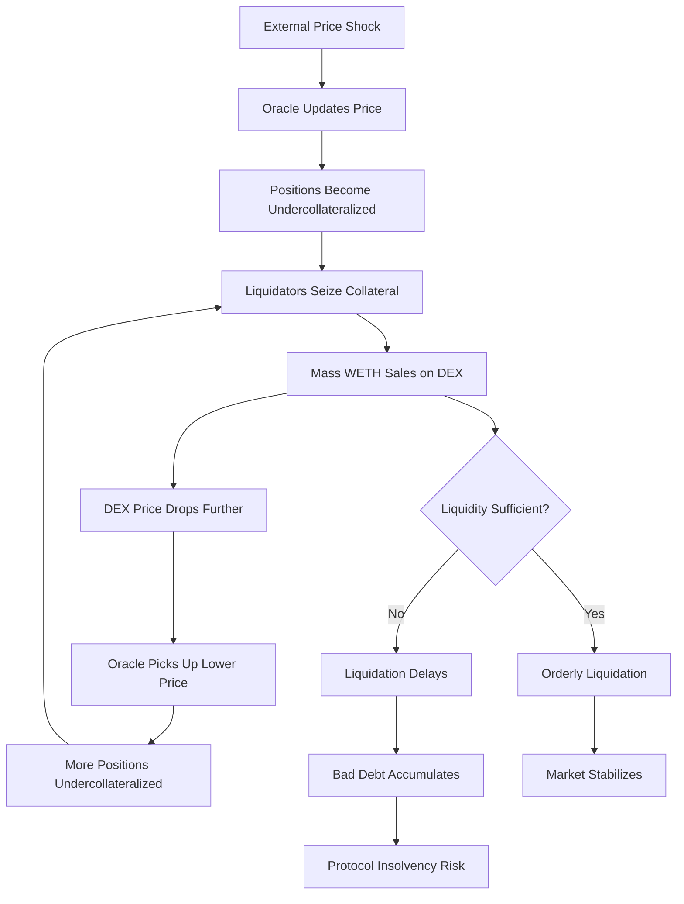

# What Happens to $45M of Morpho Debt When ETH Falls 20%?

*An analysis of liquidation cascades, on-chain liquidity, and the "death spiral" risk on Base*

## Table of Contents

1. [Introduction](#introduction)
2. [The Market We Analyzed](#the-market-we-analyzed)
3. [Historical Reference: The August 5, 2024 Crash](#historical-reference-the-august-5-2024-crash)
4. [What If August 5, 2024 Happened Today?](#what-if-august-5-2024-happened-today)
5. [Can Base DEXs Handle This? We Tested It](#can-base-dexs-handle-this-we-tested-it)
6. [The "Death Spiral" Explained](#the-death-spiral-explained)
7. [Oracle Reliability During the Crash](#oracle-reliability-during-the-crash)
8. [Simulation Limitations](#simulation-limitations)
9. [Key Takeaways](#key-takeaways)
10. [Recommendations](#recommendations)
11. [Data Sources](#data-sources)
12. [About Us](#about-us)
13. [FAQ](#faq)

## Introduction

Recent market volatility (February 2026 saw ETH drop ~20% in days) reminds us that liquidation risk isn't theoretical, it's imminent. This article examines what would happen to the Morpho Blue WETH/USDC market on Base if history repeated itself.

We backtest scenarios using real borrower positions, historical oracle prices, and verified liquidity simulations to quantify the risk of cascading liquidations.

## The Market We Analyzed

| Parameter | Value | Source |
|-----------|-------|--------|
| Protocol | Morpho Blue | [Morpho API](https://blue-api.morpho.org/graphql) |
| Market | WETH/USDC on Base | Chain ID: 8453 |
| Total Borrowed | ~$45.56M | *Collected: January 27, 2026* |
| Liquidation LTV (LLTV) | 86% | Protocol parameter |
| Active Borrowers Analyzed | 50 (top positions) | *Collected: January 27, 2026* |

> **⚠️ Note on Data Freshness:** The borrower position data was collected on **January 27, 2026**. Current market conditions may differ significantly. This analysis is illustrative and should be treated as a methodology demonstration, not real-time risk assessment.

## Historical Reference: The August 5, 2024 Crash

On August 5, 2024, ETH experienced a flash crash of **-17% in ~7 hours**:

| Time (UTC) | ETH Price | Drop from Peak |
|------------|-----------|----------------|
| Aug 4, 23:00 | $2,695.59 | Baseline |
| Aug 5, 01:00 | $2,343.51 | **-13.1%** |
| Aug 5, 06:00 | $2,235.97 | **-17.0%** |

*Source: Dune Analytics, hourly aggregated Chainlink ETH/USD prices. Data period: August-September 2024.*

This event serves as our stress test scenario.

## What If August 5, 2024 Happened Today?

Using the borrower data collected in January 2026, we simulated various price drops:

| Price Drop | Positions Liquidatable | At-Risk Debt | At-Risk Collateral |
|------------|------------------------|--------------|-------------------|
| 5% | 1 | $389,000 | ~154 WETH |
| 10% | 4 | $1,170,000 | ~455 WETH |
| **17%** *(Aug 5 scenario)* | 8 | **~$2,200,000** | ~820 WETH |
| 20% | 12 | $5,510,000 | ~2,074 WETH |
| 50% | 43 | $16,450,000 | ~4,633 WETH |

*Data: Morpho Blue GraphQL API, borrower snapshot January 27, 2026.*

At a **20% drop**, similar to recent market conditions, **$5.5M of debt** across 12 positions would become liquidatable.

## Can Base DEXs Handle This? We Tested It.

We manually simulated large WETH sales on the **DefiLlama Aggregator** (routing through 1inch and CowSwap) to measure real-world price impact.

### Verified Simulation Results (February 6, 2026)

| WETH Sold | Approx. USD Value | Verified Price Impact | Assessment |
|-----------|-------------------|-----------------------|------------|
| 500 | ~$960k | **~0.00%** |  Safe |
| 2,500 | ~$4.8M | **~0.19%** |  Safe |
| 5,000 | ~$9.6M | **~1.19%** |  Strain |
| 12,500 | ~$24M | **~4.82%** |  Critical |

*Source: DefiLlama Swap (aggregator), Base network, February 6, 2026. Routed via 1inch/CowSwap.*

### Key Finding

The market can absorb **~$5M in liquidations with minimal impact** (~0.2% slippage). However, if liquidation volumes reach **$24M+** (as in a 50% crash), a single liquidation wave would incur **~5% additional slippage**, potentially triggering further liquidations.

## The "Death Spiral" Explained

When collateral is sold during liquidation, it depresses the market price. This can push additional positions underwater, triggering more liquidations in a self-reinforcing loop.

### Cascade Impact (Verified Numbers)

| Phase | Trigger | WETH to Sell | Verified Slippage | Cumulative Drop |
|-------|---------|--------------|-------------------|-----------------|
| Initial Crash | External event | 0 | -17% | -17.0% |
| Wave 1-3 | HF < 1.0 | ~639 WETH | < 0.1% | -17.1% |
| Wave 4 | Deep cascade | ~2,074 WETH | ~0.19% | -17.2% |
| Liquidity Crisis | >12k WETH | Pending | **~4.82%** | **>22%** |

*Source: DefiLlama Aggregator simulation, February 2026.*

## Oracle Reliability During the Crash

We compared ETH/USD prices from **Dune Analytics** (hourly aggregates) and **The Graph** (raw on-chain updates) during August 5, 2024.

| Time (UTC) | Dune Price | Graph Price | Time Diff | Deviation |
|------------|------------|-------------|-----------|-----------|
| 01:00 | $2,343.51 | $2,533.73 | **59 sec** | **7.5%** |
| 06:00 | $2,235.97 | $2,315.06 | 49 sec | 3.4% |
| 07:00 | $2,321.51 | $2,266.29 | 1 sec | 2.4% |

*Source: `oracleBackTest` tool, Dune Analytics + The Graph comparison. Data period: August 2024.*

> **⚠️ Is This a Timing Issue?**  
> The 7.5% deviation at 01:00 UTC occurred with only a **59-second difference** between data sources, not a timing artifact. During extreme volatility, oracle aggregation methods (hourly snapshots vs. per-update events) can diverge significantly, even when sampling nearly the same moment.

This matters because:
- Delayed on-chain prices could **delay liquidations**, increasing bad debt risk.
- Premature or "flash" prices could cause **unfair liquidations**.
- MEV bots can exploit these discrepancies.

## Simulation Limitations

This analysis has important limitations that affect its real-world applicability:

1. **DEX Liquidity Assumes Normal Conditions**  
   Our swap simulations were conducted during *normal* market conditions. In a real 17-20% crash, liquidity providers may **withdraw liquidity** to avoid impermanent loss. The actual slippage during a crash would likely be **worse** than our tested figures.

2. **Snapshot Data, Not Real-Time**  
   The borrower positions (January 27, 2026) and the DEX simulations (February 6, 2026) are from different timestamps. We are modeling a **virtual scenario**, not a live backtest.

3. **No Consideration of Concurrent Selling Pressure**  
   Our simulations assume a single liquidator selling collateral. In reality, multiple liquidators, panicked holders, and arbitrage bots would all be selling simultaneously, amplifying price impact.

4. **Oracle Data Granularity Differs**  
   Dune Analytics provides hourly aggregated prices; The Graph provides per-update event data. Comparing these directly introduces methodology-based discrepancies, though we minimized this with ±30-minute matching windows.

## Key Takeaways

| Finding | Severity | Implication |
|---------|----------|-------------|
| First liquidation at **5% drop** | High | One $389k position is extremely vulnerable |
| **$5.5M at risk** at 20% drop | Critical | 12 positions, ~12% of analyzed debt |
| DEX can absorb **~$5M safely** | Good News | 20% crash liquidations are manageable |
| **>$10M triggers 1%+ slippage** | Warning | Cascade risk begins above this threshold |
| **$24M triggers ~5% slippage** | Critical | This alone could cause a death spiral |
| **7.5% oracle deviation** (verified) | Medium | Not a timing issue, real divergence during volatility |

## Recommendations

### For Borrowers
- Maintain Health Factor **> 1.3** to survive 25%+ crashes
- Set automated alerts at HF < 1.2

### For Protocols
- Consider dynamic LLTV adjustments during high volatility
- Implement circuit breakers for flash crash scenarios

### For Liquidators
- Use aggregators like 1inch/CowSwap to minimize slippage
- Prefer incremental liquidations over full position seizures

## Data Sources

| Source | Description | Date |
|--------|-------------|------|
| Morpho Blue GraphQL API | Borrower positions | Jan 27, 2026 |
| Dune Analytics | Chainlink ETH/USD hourly | Aug-Sep 2024 |
| The Graph | Chainlink price updates | Aug-Sep 2024 |
| DefiLlama Swap | Manual slippage simulation | Feb 6, 2026 |

*This analysis was conducted using data from the Morpho WETH/USDC market on Base. For the full technical report with additional tables and code, see the accompanying [Liquidation Risk Report](https://github.com/SCAuditStudio/MorphoResources/blob/main/Morpho%20WETH-USDC%20Analysis/liquidation_risk_report.md).*

## About Us

At SC Audit Studio, we specialize in protocols security assessments.
Our team of experts has worked with companies like Aave, 1Inch and several more to conduct security assessments.
Partner with us to enhance your project's security and gain peace of mind.

[Reach out to us](https://x.com/SCAuditStudio) for queries and security assessments!

## FAQ

[
  {
    "question": "What is a liquidation cascade?",
    "answer": "A liquidation cascade occurs when collateral sold during liquidation depresses the market price, pushing additional positions underwater and triggering more liquidations in a self-reinforcing loop that can destabilize an entire lending market."
  },
  {
    "question": "How does on-chain liquidity affect liquidation risk?",
    "answer": "Limited DEX liquidity means large liquidations cause significant price slippage. Our analysis shows Base DEXs can absorb ~$5M safely, but volumes exceeding $10M trigger 1%+ slippage, and $24M causes ~5% slippage that could initiate a death spiral."
  },
  {
    "question": "What Health Factor should borrowers maintain?",
    "answer": "We recommend maintaining a Health Factor greater than 1.3 to survive 25%+ market crashes. Setting automated alerts at HF < 1.2 provides early warning to add collateral or repay debt before liquidation."
  },
  {
    "question": "Why do oracle deviations matter during crashes?",
    "answer": "Oracle deviations during volatility can cause delayed or premature liquidations. Delayed prices increase bad debt risk, while flash prices may trigger unfair liquidations. MEV bots can exploit these discrepancies for profit."
  }
]
