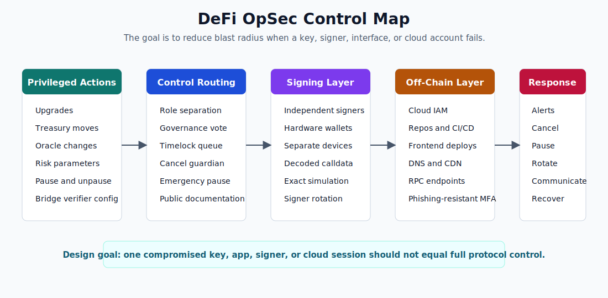

# DeFi OpSec Best Practices for 2026

This guide is for DeFi founders, protocol engineers, DAO operators, and security leads who are asking a practical question: how should a protocol secure governance, timelocks, multisigs, admin keys, and signing workflows in 2026?

The answer is not simply "use a multisig" or "buy hardware wallets." Those controls matter, but they do not solve the whole problem. In 2024, [Chainalysis](https://www.chainalysis.com/blog/2025-crypto-crime-report-introduction/) reported that private key compromise accounted for 43.8% of stolen crypto, more than any other verified attack type. That number matters because most DeFi protocols still give privileged keys the power to upgrade contracts, move treasury funds, list collateral, change oracle settings, pause markets, or replace critical infrastructure.

In DeFi, operational security means the people, systems, and procedures that can cause on-chain state changes. If the contract is audited but the upgrade key is exposed, the protocol is still exposed. If the multisig has seven signers but all sign from the same laptops and the same chat workflow, the protocol is still exposed. If governance has a timelock but nobody watches the queue, the protocol has delay, not defense.

For a deeper breakdown of recent off-chain compromise patterns, see our related article on [OPSEC in Web3 attacks](https://scauditstudio.com/blog/Web3OpSecHacks). This article focuses on the controls a protocol can put in place before those attacks happen.

## TL;DR

- Treat every privileged function as part of the protocol's attack surface, including upgrades, treasury movements, parameter changes, oracle changes, pause controls, and bridge verifier settings.
- Use role separation. The same multisig should not control every high-risk action.
- Put high-impact actions behind timelocks that are long enough to review and cancel. A timelock without monitoring is not useful.
- Build multisig signer independence. Different people, devices, networks, physical locations, recovery paths, and communication channels matter.
- Hardware wallets protect private keys, but they do not prove that the payload shown in a web interface matches the payload being signed.
- Protect cloud, GitHub, CI/CD, frontend deployment, RPC infrastructure, and password managers with phishing-resistant authentication.
- Run incident drills. A crisis plan that has never been tested usually fails when signers are asleep, traveling, or unsure who can authorize what.

## Table of Contents

1. [What DeFi OpSec Covers](#what-defi-opsec-covers)
2. [Start With a Privileged Function Map](#start-with-a-privileged-function-map)
3. [Governance Controls](#governance-controls)
4. [Timelocks](#timelocks)
5. [Multisig Design](#multisig-design)
6. [Signer Workflow](#signer-workflow)
7. [Off-Chain Infrastructure](#off-chain-infrastructure)
8. [Monitoring and Alerting](#monitoring-and-alerting)
9. [Incident Response](#incident-response)
10. [2026 OpSec Checklist](#2026-opsec-checklist)
11. [Conclusion](#conclusion)
12. [About Us](#about-us)
13. [Tags](#tags)
14. [FAQ](#faq)

## What DeFi OpSec Covers

DeFi OpSec covers every control path that can affect user funds or protocol state. Smart contract code is one part of that surface. The operational layer around the contracts is another part.

A simple lending market may have privileged functions for upgrades, collateral listings, interest rate changes, liquidation parameter changes, reserve withdrawals, oracle updates, and emergency pauses. A bridge may have validator or verifier settings. A vault may have curator roles, supply caps, guardian roles, and fee controls. A DAO may have proposal creation rules, delegate voting, quorum, execution delays, and cancellation rights.

The mistake is treating these permissions as admin chores instead of security-critical design. If a compromised key can upgrade implementation logic, it can become equivalent to a smart contract exploit. If a compromised frontend can make signers approve a different payload than the one they think they reviewed, the signature is valid even though the intent is false. If a compromised cloud account can replace a production interface or CI artifact, the attack may happen before the transaction reaches the chain.

[Trail of Bits](https://blog.trailofbits.com/2025/06/25/maturing-your-smart-contracts-beyond-private-key-risk/) describes this as access control maturity: protocols move from a single EOA, to a centralized multisig, to timelocks and role separation, and eventually toward designs that remove privileged control where possible. That maturity model is useful because it focuses on blast radius. The question is not only "can an attacker get a key?" The better question is "what can an attacker do if one control point fails?"

## Start With a Privileged Function Map

Before choosing thresholds or delays, write down every privileged action. Do not rely on memory. Pull the roles from deployed contracts, access control registries, deployment scripts, governance contracts, multisig owners, timelocks, and infrastructure runbooks.

For each action, record five fields:

| Field | Question |
|---|---|
| Action | What can be changed or moved? |
| Controller | Which address or system can trigger it? |
| Impact | What happens if this action is malicious? |
| Delay | Is there time to detect and cancel it? |
| Recovery | Who can stop, reverse, or mitigate it? |

This mapping should expose uncomfortable findings. For example, an operations multisig may have permission to change both harmless UI settings and dangerous oracle parameters. A governor may be configured correctly, but the timelock admin may still be held by a deployer wallet. A pause guardian may be able to stop deposits but not borrows, creating a false sense of safety during a market incident.

Group actions by risk:

- Critical actions: contract upgrades, treasury withdrawals, bridge verifier changes, oracle source changes, mint authority, and ownership transfers.
- High-risk actions: collateral listings, borrow caps, supply caps, liquidation parameters, fee changes, and emergency unpauses.
- Routine actions: grant payments, low-value parameter changes, allowlist maintenance, and non-critical operational updates.

Do not use the same route for all three categories. Critical actions should require the strongest threshold, longest delay, and most review. Routine actions can use shorter delays and lower thresholds if their blast radius is capped.

## Governance Controls

Governance is the process that decides whether a protocol action should happen. In token-governed systems, voting power usually comes from governance token balances or delegated token balances. This creates two risks that need to be explained clearly.

First, voting power can be borrowed or temporarily concentrated. If a protocol counts current balances at execution time, an attacker may use flash loans or short-term liquidity to pass an action they could not support economically over time. Snapshot-based voting reduces this by measuring voting power at a prior block or timestamp.

Second, voter apathy can turn a broad token distribution into narrow practical control. If only a few delegates vote regularly, those delegates become the real governance system. That may be acceptable if it is explicit and monitored. It is dangerous when the protocol pretends to be broadly decentralized while only three wallets determine outcomes.

Use a governance framework that supports voting delay, voting period, quorum, proposal threshold, cancellation, and timelock execution. [OpenZeppelin](https://docs.openzeppelin.com/contracts/5.x/governance) documents these components in its Governor and TimelockController flow. The important point is not the brand of contract. The important point is that proposal creation, vote measurement, queueing, execution, and cancellation are separate stages with clear rules.

The [Beanstalk governance exploit](https://rekt.news/beanstalk-rekt) shows why this matters. The attacker used a flash-loan-backed governance action to drain the protocol. The lesson is not simply "flash loans are bad." The lesson is that governance needs delay, review, quorum design, proposal transparency, and active monitoring. A proposal that can move all assets should never become executable before defenders have time to inspect it and users have time to react.

For more detail on upgrade delays and their tradeoffs, read our separate piece on [timelocks during major protocol upgrades](https://scauditstudio.com/blog/Timelocks-Unlocking-Safety-or-Locking-in-Risk-During-Major-Protocol-Upgrades).

## Timelocks

A timelock is a contract-enforced waiting period between approval and execution. It gives users, delegates, auditors, and security monitors time to inspect an action before it changes the protocol.

Timelocks are often misunderstood. A timelock does not make a bad proposal safe. It only creates a response window. The window matters only if someone is watching, understands the payload, and can cancel or mitigate the action before execution.

Use different delays for different risks:

| Action type | Suggested delay | Reason |
|---|---:|---|
| Routine operations | 12 to 24 hours | Enough time for basic review without blocking daily operations |
| Parameter changes with market impact | 24 to 72 hours | Gives risk teams and users time to model effects |
| Contract upgrades and oracle changes | 72 hours to 7 days | High blast radius requires deeper review |
| Timelock delay reductions | Same or longer than the protected action | Attackers should not be able to shorten the delay first |

The exact values depend on TVL, volatility, chain finality, and user expectations. A small testnet deployment does not need the same process as a nine-figure lending market. The principle is stable: the delay should be long enough for detection and response, not just long enough to look good in documentation.

Every timelock needs a cancellation path. If the governor can queue an action but nobody can cancel a malicious queued action, the protocol has created an observation period without an emergency brake. Cancellation rights should be narrow, documented, and monitored. A cancel guardian can be useful, but it should not quietly become a dictator role that can block all governance forever.

Timelocks also need human-readable proposal data. A proposal that says "upgrade implementation" is not reviewable. It should include the target contracts, function selectors, decoded calldata, expected state changes, risk assessment, tests, simulation links, audit references if relevant, and an explanation of why the timing is acceptable.

## Multisig Design

A multisig reduces single-key risk by requiring M approvals from N owners. It does not automatically create operational independence. A 4-of-7 multisig is weak if all seven signers work at the same company, use the same password manager, join the same chat room, and sign from daily-use laptops.

[Safe](https://docs.safe.global/home/what-is-safe) is the most common smart account stack for DeFi multisigs, but the security outcome depends on configuration and workflow. Focus on these design choices:

- Threshold: choose a threshold that can tolerate unavailable signers without making compromise easy.
- Independence: signers should not share employer, device setup, cloud accounts, password managers, or recovery phrases.
- Geography and time zones: global distribution reduces the chance that all signers are offline or exposed to the same local incident.
- Rotation: have a documented process for replacing signers when people leave, change roles, or lose device integrity.
- Scope: use separate multisigs for different roles instead of one wallet with every permission.
- Transparency: publish the addresses, thresholds, roles, and signer rotation policy where users and delegates can find them.

For many serious protocols, 3-of-5 is a practical floor and 4-of-7 is stronger for critical controls. That is not a universal rule. A 2-of-3 may be reasonable for a low-value operations wallet with capped permissions. A 6-of-9 may be appropriate for a treasury or upgrade role, but it can become slow in emergencies. The right threshold depends on value at risk, signer quality, response expectations, and whether a timelock exists after signing.

The key question is: if an attacker compromises one signer, does that signer help compromise the others? If the answer is yes, the effective threshold is lower than the on-chain threshold.

## Signer Workflow

Signer workflow is where many teams overestimate their security. Hardware wallets are important because they keep private keys out of normal software memory. They do not prove that the signer understands the contract call. They also do not prove that the web interface displayed the same action that the hardware wallet signed.

The 2024 Radiant Capital incident, analyzed by [Mandiant](https://cloud.google.com/blog/topics/threat-intelligence/unc4736-radiant-capital-theft/), is a useful warning because it involved a compromised signing path rather than a simple leaked private key. The 2025 Bybit incident, attributed by the [FBI](https://www.ic3.gov/PSA/2025/PSA250226) to North Korean actors, showed a related issue at a different layer: signers depended on the transaction interface to represent intent correctly.

The practical control is independent verification. Signers should not approve high-risk actions based only on the primary web app. A better workflow looks like this:

1. Proposal author publishes a plain-language change summary, decoded calldata, expected target addresses, and expected state changes.
2. A separate reviewer verifies the calldata against source code, deployment addresses, and the intended action.
3. Each signer checks the transaction through a separate decoding path, ideally on a separate device and RPC endpoint.
4. At least one signer simulates the exact queued transaction, not a similar transaction prepared earlier.
5. The team records transaction hash, signer approvals, simulation output, and final execution result.

For critical actions, use a clean signing device. This does not always mean a fully air-gapped machine, but daily-use laptops are poor signing environments for protocol upgrades. Signers who handle critical permissions should avoid opening unsolicited files, installing browser extensions, using personal password managers for work credentials, or mixing social accounts with signing operations.

## Off-Chain Infrastructure

Many protocol actions pass through Web2 systems before they touch a blockchain. The frontend builds a transaction. The CI/CD system deploys code. The cloud account hosts infrastructure. The DNS account points users to the interface. RPC providers return state. Password managers and identity providers control access to all of the above.

That means a protocol's OpSec scope includes:

- GitHub or GitLab organizations
- CI/CD runners and deployment tokens
- Package registries and dependency update systems
- Frontend hosting, S3 buckets, CDNs, and DNS
- RPC endpoints and fallback configuration
- Cloud IAM, service accounts, and session tokens
- Password managers and recovery processes
- Internal chat, ticketing, and incident channels

Use phishing-resistant authentication for these systems wherever possible. [NIST](https://pages.nist.gov/800-63-4/sp800-63b.html) treats phishing-resistant authentication as a stronger requirement at higher assurance levels, and DeFi teams should apply that standard to accounts that can affect production systems or signing workflows. SMS, email codes, and push-only MFA are not enough for cloud admins, repository owners, release engineers, or multisig signers.

Access should also be least privilege. A frontend deploy key should not be able to rotate multisig owners. A developer's cloud session should not have permanent access to production secrets. CI should not have broad write access unless the deployment path requires it, and even then it should be constrained by environment, branch, approval, and time.

For teams preparing a codebase for external review, our article on [getting more value from a smart contract audit](https://scauditstudio.com/blog/Maximizing-the-Value-of-Your-Smart-Contract-Audit) covers why design documentation, test clarity, and clean deployment assumptions matter before auditors start.

## Monitoring and Alerting

Monitoring should cover both on-chain and off-chain signals.

On-chain monitoring should alert on:

- New governance proposals
- Queued timelock operations
- Timelock delay changes
- Ownership transfers
- Role grants and revocations
- Multisig owner or threshold changes
- Large treasury transfers
- Oracle source changes
- Upgrade events
- Pause and unpause events

Do not alert only to a public channel that nobody checks on weekends. Route critical alerts to named responders. Define severity. A queued upgrade to a core market is not the same as a small grant payment. Alerts should include decoded calldata, target addresses, execution window, links to source code, and a direct escalation path.

Off-chain monitoring should include cloud login anomalies, new repository deploy keys, unexpected CI workflow changes, DNS changes, package publication events, frontend hash changes, and new password manager device approvals. These events are not "IT noise" for a DeFi protocol. They may be the first sign that an attacker is preparing a valid on-chain transaction through a compromised operational path.

The most important monitoring test is simple: queue a harmless test transaction and see whether the right people notice. If the only person who sees the alert is the person who queued it, the system is not monitoring. It is logging.

## Incident Response

Incident response should be written before an incident. During a real compromise, teams lose time deciding who can speak, who can sign, who can pause, who can cancel, and which communication channel is trusted.

Create runbooks for at least four scenarios:

- Malicious governance proposal
- Suspicious queued timelock transaction
- Multisig signer compromise
- Frontend, DNS, cloud, or CI/CD compromise

Each runbook should list the first 15 minutes, first hour, and first day. The first 15 minutes are about containment: verify the signal, stop further damage, assemble responders, preserve evidence, and avoid signing anything unclear. The first hour is about cancellation, pausing, rotating credentials, contacting signers, and public communication if users need to avoid an interface or market. The first day is about root cause analysis, patching, governance recovery, and user-facing status updates.

Do not depend on individual DMs as the crisis channel. Use a pre-agreed emergency channel with known participants and backup contacts. Do not let one compromised chat account steer the response. For signer compromise, assume the attacker may read internal communications until proven otherwise.

Run drills. A drill should test whether signers can be reached, whether the cancel path works, whether the pause function covers the affected surface, whether the public status page can be updated, and whether responders know where current deployment addresses are documented.

## 2026 OpSec Checklist

Use this checklist as a baseline before mainnet launch or before a major upgrade.

| Area | Control |
|---|---|
| Privileged functions | Every privileged function is mapped to a controller, delay, impact, and recovery path. |
| Role separation | Critical upgrades, routine operations, emergency pause, and cancellation rights are separated. |
| Governance | Voting delay, voting period, quorum, proposal threshold, snapshot logic, and cancellation are documented. |
| Timelocks | High-risk actions use meaningful delays and monitored execution windows. |
| Multisig | Thresholds match value at risk, signers are independent, and signer rotation is documented. |
| Signing | Critical transactions are decoded and simulated through an independent path before approval. |
| Workstations | Critical signers use hardened devices and avoid daily-use browsing during signing. |
| Cloud and repos | Phishing-resistant MFA protects production cloud, repository, CI/CD, DNS, and password manager access. |
| Monitoring | On-chain and off-chain alerts route to named responders with severity levels. |
| Incident response | Runbooks exist and have been tested through drills. |
| Documentation | Users can find admin addresses, timelock delays, governance parameters, and emergency powers. |
| Audits | Audit scope includes privileged roles, upgrade paths, deployment scripts, and operational assumptions. |

## Conclusion

DeFi OpSec in 2026 is about limiting what compromised control points can do. A mature setup does not assume every signer, frontend, cloud account, and governance process will stay clean forever. It assumes something will fail and makes sure one failure does not become full protocol control.

The practical path is clear: map privileged functions, split roles, add monitored timelocks, use independent multisig signers, verify signing payloads outside the primary interface, harden off-chain infrastructure, and rehearse incident response. These controls are not glamorous, but they decide whether an attacker gets a failed attempt or a protocol-level incident.

## About Us

SC Audit Studio publishes smart contract security research and reviews protocol designs, privileged access patterns, governance flows, and operational assumptions across EVM and non-EVM systems.

## Tags

["Security","OpSec","Governance","Multisig","Timelock","DeFi"]

## FAQ

[
  {
    "question": "What is DeFi OpSec?",
    "answer": "DeFi OpSec is the set of operational controls around a protocol's privileged actions. It includes governance, timelocks, multisigs, signer devices, cloud access, frontend deployment, CI/CD, RPC infrastructure, monitoring, and incident response."
  },
  {
    "question": "Is a multisig enough for protocol security?",
    "answer": "No. A multisig reduces single-key risk, but it does not solve signer collusion, shared device compromise, malicious transaction interfaces, missing timelocks, or overbroad admin permissions."
  },
  {
    "question": "How long should a DeFi timelock be?",
    "answer": "Routine actions may use 12 to 24 hours, market-sensitive parameter changes often need 24 to 72 hours, and critical upgrades or oracle changes commonly need 72 hours to 7 days. The delay should be long enough for review and cancellation."
  },
  {
    "question": "Do hardware wallets prevent malicious multisig transactions?",
    "answer": "Hardware wallets protect private keys, but they do not guarantee that the signer understands the encoded contract call or that the web interface displayed the true payload. Critical transactions still need independent decoding and simulation."
  },
  {
    "question": "What should be monitored in a DeFi OpSec program?",
    "answer": "At minimum, monitor governance proposals, queued timelock actions, role changes, ownership transfers, multisig threshold changes, treasury movements, upgrades, oracle changes, cloud logins, CI/CD changes, frontend deployments, DNS changes, and repository access changes."
  }
]
